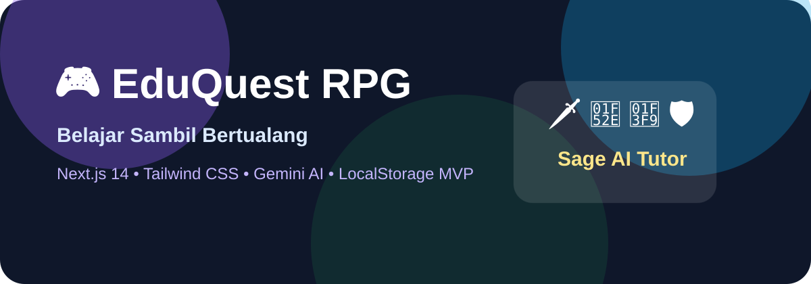

# 🎮 EduQuest RPG - Belajar Sambil Bertualang



EduQuest RPG adalah platform pembelajaran gamified untuk siswa SMP kelas 7-9. Aplikasi ini menggabungkan mekanik RPG, battle edukatif, dashboard analytics, social learning, dan AI tutor **Sage** berbasis Google Gemini. MVP menggunakan `localStorage` sehingga dapat berjalan tanpa database eksternal, namun struktur datanya siap ditingkatkan ke Vercel Postgres/Supabase.

---

## 1. 📖 Deskripsi Singkat

EduQuest RPG menjawab masalah belajar yang sering terasa pasif dan membosankan. Siswa membuat karakter, memilih kelas RPG, menerima quest harian, bertarung melawan monster berbasis mata pelajaran, mendapat XP/gold/loot, membuka achievement, dan bertanya ke AI tutor kapan pun.

Aplikasi ini dirancang mobile-first dan siap deploy ke Vercel. Jika API key Gemini tidak tersedia atau quota habis, sistem otomatis memakai static fallback questions yang tetap bisa digunakan untuk demo sekolah.

---

## 2. ✨ Fitur Utama

### 2.1 Sistem Karakter RPG

- Pembuatan akun lokal dan karakter.
- 8 avatar berbeda.
- 4 kelas RPG:
  - 🗡️ Matematika Warrior: bonus damage/XP pada Matematika.
  - 🔮 Science Mage: bonus HP.
  - 🏹 Language Ranger: bonus XP pada pelajaran bahasa.
  - 🛡️ Social Knight: bonus gold pada IPS.
- Level 1-100.
- XP dan `xpToNextLevel` progresif.
- Stats: INT, CRE, MEM, SPD.
- Custom theme color.
- Title/gelar karakter.
- Demo account level 18.

### 2.2 Inventory, Loot, Crafting

- Kategori inventory:
  - Weapons.
  - Armor.
  - Potions.
  - Badges.
- 50 item statis.
- Rarity: Common, Rare, Epic, Legendary.
- Potion bisa dipakai.
- Equip/showcase item stat.
- Craft 3 item Common menjadi 1 Rare.
- Loot drop setelah battle.

### 2.3 Achievement System

- 50 achievement.
- Kategori Study, Battle, Social, Special.
- Unlock title.
- Reward XP dan gold.
- Showcase achievement.

### 2.4 AI-Powered Quest System

- Endpoint `/api/ai/generate-questions`.
- Input: mata pelajaran, topik, difficulty, kelas, jumlah.
- Output JSON structured questions.
- Gemini model: `gemini-pro` via `@google/generative-ai`.
- Retry exponential backoff.
- Rate limit queue 60 request per menit.
- In-memory cache untuk hemat quota.
- Fallback static questions jika API gagal.
- Hint AI max 2 per soal.
- Explain wrong answer dengan AI/fallback.
- Daily quest generator 10 quest per hari.
- Adaptive difficulty dari subject mastery.

### 2.5 AI Tutor Assistant - Sage

- Chat interface ramah.
- Context-aware conversation menggunakan 10 pesan terakhir.
- Markdown rendering.
- Voice-to-text via Web Speech API pada browser yang mendukung.
- Favorite explanations.
- Share/copy explanations.
- Study plan generator mingguan.
- Quick prompt untuk quiz, summary, homework helper, dan motivasi.

### 2.6 Battle System Edukatif

- Story mode 10 chapter.
- Normal battle 5 soal.
- Boss battle 10 soal.
- HP bar player dan monster.
- Combo system.
- Damage multiplier.
- Use potion.
- Victory reward XP, gold, loot.
- 30 monster edukatif.
- Animasi CSS/Framer Motion.

### 2.7 Social Features

- Leaderboard lokal berdasarkan data player di localStorage.
- Ranking by level dan total XP.
- Friend system by username lokal.
- Guild create/join.
- Guild chat sederhana.
- Quiz battle PvP simulasi best of 10 questions.

### 2.8 Dashboard & Analytics

- Progress overview.
- Subject mastery circular progress.
- XP chart 7 hari terakhir.
- Radar chart kekuatan mata pelajaran.
- Accuracy percentage.
- Average time per question.
- Study streak.
- Calendar activity heatmap.
- AI insight weekly summary.
- Exam readiness score.

### 2.9 Gamification

- Daily login reward.
- Study streak.
- Loot system.
- Pet/companion unlock level 10, 25, 50, 75, 100.
- Feed pets with gold.
- Mini-games:
  - Quick Math Challenge.
  - Memory Card Game.
  - Word Search.

---

## 3. 🚀 Tech Stack

| Area | Teknologi |
| --- | --- |
| Framework | Next.js 14 App Router |
| Language | TypeScript strict mode |
| Styling | Tailwind CSS |
| UI | shadcn/ui-inspired components |
| Animation | Framer Motion |
| Charts | Recharts |
| AI | Google Gemini API (`gemini-pro`) |
| Data | localStorage MVP |
| Validation | Zod |
| Icons | lucide-react |
| Markdown | react-markdown |
| Deployment | Vercel |

---

## 4. 📦 Installation

```bash
# 1. Clone repository
git clone <repo-url>
cd Rpg

# 2. Install dependencies
npm install

# 3. Copy env template
cp .env.example .env.local

# 4. Isi API key Gemini jika ingin AI live
# GEMINI_API_KEY=your_key_here

# 5. Jalankan development server
npm run dev
```

Buka `http://localhost:3000`.

---

## 5. 🔧 Configuration

Buat file `.env.local`:

```bash
GEMINI_API_KEY=your_google_ai_studio_api_key_here
NEXT_PUBLIC_APP_URL=http://localhost:3000
NEXT_PUBLIC_APP_NAME=EduQuest RPG
```

`NEXT_PUBLIC_GEMINI_API_KEY` juga didukung untuk demo cepat, tetapi server-side `GEMINI_API_KEY` lebih aman.

---

## 6. 🎯 Usage Guide untuk Siswa

1. Buka aplikasi.
2. Login demo atau register akun baru.
3. Pilih avatar dan kelas RPG.
4. Masuk Dashboard untuk melihat level.
5. Buka Quest AI untuk generate soal.
6. Jawab pertanyaan.
7. Minta hint maksimal 2 kali.
8. Baca penjelasan jawaban.
9. Masuk Battle untuk melawan monster.
10. Gunakan potion jika HP rendah.
11. Klaim daily reward.
12. Chat dengan Sage saat butuh bantuan.
13. Cek achievement dan inventory.

---

## 7. 🏗️ Project Structure

```text
app/
  api/ai/
    chat/route.ts
    daily-quests/route.ts
    explain-answer/route.ts
    generate-questions/route.ts
    hint/route.ts
    insights/route.ts
    study-plan/route.ts
  globals.css
  layout.tsx
  page.tsx
components/
  eduquest-app.tsx
  ui/
    badge.tsx
    button.tsx
    card.tsx
    input.tsx
    label.tsx
    progress.tsx
    select.tsx
    textarea.tsx
lib/
  game-engine.ts
  gemini-service.ts
  static-data.ts
  storage.ts
  types.ts
  utils.ts
public/
  manifest.json
```

Penjelasan:

- `components/eduquest-app.tsx`: single-page interactive game shell.
- `lib/game-engine.ts`: XP, level, reward, battle damage, achievement, daily reward.
- `lib/gemini-service.ts`: integrasi Gemini, retry, rate limiting, cache, fallback.
- `lib/static-data.ts`: soal fallback, monster, item, achievement, pet, title.
- `lib/storage.ts`: localStorage persistence.
- `app/api/ai/*`: API routes untuk AI.

---

## 8. 🤖 AI Integration

### Generate Questions Flow

1. User memilih subject, topic, difficulty, grade, count.
2. Client mengirim POST ke `/api/ai/generate-questions`.
3. Server validasi input dengan Zod.
4. `gemini-service` membuat prompt structured JSON.
5. Request masuk queue rate limiter.
6. Gemini menghasilkan JSON.
7. Response diparse dan dinormalisasi.
8. Hasil dicache.
9. Jika gagal, static fallback dipakai.
10. Client menampilkan preview dan bisa mulai quiz.

### Sage Chat Flow

1. User mengirim pesan.
2. 10 pesan terakhir dikirim sebagai context.
3. System prompt Sage membatasi gaya jawaban.
4. Gemini menjawab maksimal 150 kata.
5. Client render markdown.
6. User bisa favorite/share.

### AI Safety

- Input disanitasi.
- Prompt meminta bahasa ramah siswa SMP.
- AI diarahkan agar tidak langsung membocorkan jawaban PR.
- API key server-side.
- Fallback tersedia.

---

## 9. 📊 Database Schema MVP

Data disimpan sebagai JSON pada browser localStorage.

### Keys

| Key | Isi |
| --- | --- |
| `eduquest.users.v1` | Array UserProfile |
| `eduquest.currentUser.v1` | Username aktif |
| `eduquest.guilds.v1` | Array Guild |

### UserProfile

```ts
interface UserProfile {
  id: string;
  username: string;
  email: string;
  character: Character;
  inventory: Item[];
  achievements: string[];
  completedQuests: string[];
  stats: StudyStats;
  friends: string[];
  guildId?: string;
  chat: Message[];
  favorites: Message[];
  settings: Settings;
  pets: Pet[];
  activity: Record<string, number>;
}
```

### Upgrade Path ke Postgres

- `users` table.
- `characters` table.
- `inventory_items` table.
- `achievements_unlocked` table.
- `quests_completed` table.
- `chat_messages` table.
- `guilds` table.
- `guild_messages` table.
- `analytics_events` table.

---

## 10. 🎨 Design System

### Color Palette

- Primary: violet `#8b5cf6`.
- Secondary: sky `#0ea5e9`.
- XP: green `#22c55e`.
- Gold: amber `#f59e0b`.
- Danger: red `#ef4444`.
- Background light: slate-tinted white.
- Background dark: deep slate.

### Typography

- System font stack for offline-safe build.
- Font sizes mobile-first.
- Headings use heavy weight.
- Buttons minimum 44px touch target.

### Components

- Button variants: default, secondary, outline, ghost, destructive, gold.
- Card with rounded 3xl and shadow.
- Badge variants.
- Progress bar.
- Input, Select, Textarea, Label.

---

## 11. 🧪 Testing

```bash
npm run type-check
npm run lint
npm run build
npm run dev
```

Manual test checklist:

- Register akun baru.
- Login demo.
- Create character.
- Toggle dark mode.
- Generate AI question.
- Start quiz.
- Answer correct/wrong.
- Request hint.
- View explanation.
- Start battle.
- Use potion.
- Win battle and receive loot.
- Open inventory.
- Craft rare item.
- Claim daily reward.
- Chat with Sage.
- Generate study plan.
- Add friend.
- Create guild.
- Send guild chat.
- Play mini-games.
- Export/import progress.

---

## 12. 🚀 Deployment

1. Push repo ke GitHub.
2. Import repo di Vercel.
3. Framework terdeteksi otomatis sebagai Next.js.
4. Isi environment variable `GEMINI_API_KEY`.
5. Klik Deploy.
6. Test URL produksi.

Build command: `npm run build`.
Output: `.next`.

---

## 13. 📈 Performance

Optimisasi yang diterapkan:

- App Router.
- Client state disimpan lokal.
- Static fallback data di module.
- Gemini response cache.
- Rate limit queue.
- Lazy user interactions untuk AI.
- Recharts hanya dipakai pada dashboard.
- CSS animation ringan.
- No external font fetch agar build stabil.
- Tailwind purge aktif.

Target Lighthouse:

- Performance: >85.
- Accessibility: >90.
- Best Practices: >85.
- SEO: >85.

---

## 14. ♿ Accessibility

- Semantic buttons dan labels.
- `aria-label` pada icon buttons.
- Progress bar role.
- Keyboard navigable controls.
- Focus indicators via Tailwind ring.
- Kontras warna disesuaikan untuk light/dark.
- Touch target minimal 44px.
- Layout responsive dari 320px.

---

## 15. 🔐 Security

- API key tidak dicommit.
- `.env.example` hanya template.
- Input divalidasi Zod di API route.
- Text input disanitasi dari `<` dan `>`.
- Gemini call server-side.
- localStorage MVP tidak menyimpan data sensitif produksi.
- Password lokal di-hash sederhana untuk demo, bukan untuk produksi.
- Untuk produksi, gunakan auth provider seperti Clerk/Auth.js.

---

## 16. 📚 Static Content

Aplikasi menyediakan:

- 50 soal Matematika.
- 50 soal IPA.
- 50 soal Bahasa Indonesia.
- 50 soal Bahasa Inggris.
- 50 soal IPS.
- 30 monster edukatif.
- 50 item.
- 50 achievement.
- 10 pet companions.
- 20 title/gelar.

Static content berfungsi sebagai fallback AI dan data awal game.

---

## 17. 🧭 Demo Account

```text
Username: demo_warrior
Password: demo123
Level: 18
Class: Matematika Warrior
Title: Dragon Slayer
```

Demo account memiliki progress, inventory, pets, achievement, activity heatmap, dan chat pembuka Sage.

---

## 18. 🧑‍🏫 Manfaat untuk Guru

- Melihat progress belajar siswa pada satu dashboard.
- Mengidentifikasi mata pelajaran lemah.
- Memberi latihan tambahan secara gamified.
- Mengurangi beban membuat soal latihan awal.
- Mendukung pembelajaran mandiri.

---

## 19. 🧑‍🎓 Manfaat untuk Siswa

- Belajar terasa seperti petualangan.
- Ada feedback cepat.
- Ada motivasi lewat XP, gold, loot, achievement.
- Bisa bertanya kapan saja ke Sage.
- Bisa latihan sesuai level kemampuan.
- Bisa belajar di HP maupun laptop.

---

## 20. 🤝 Contributing

1. Fork repository.
2. Buat branch fitur.
3. Jalankan lint dan build.
4. Buat pull request.
5. Jelaskan fitur, screenshot, dan hasil test.

Standar kontribusi:

- TypeScript strict.
- Naming jelas.
- Validasi input.
- UI responsive.
- Dokumentasi update.
- Tidak commit API key.

---

## 21. 📝 License

MIT License.

---

## 22. 👥 Credits

- Next.js team.
- Tailwind CSS.
- shadcn/ui design patterns.
- Google Gemini API.
- Recharts.
- Framer Motion.
- lucide-react.
- Komunitas open source pendidikan.

---

## 23. Changelog Ringkas

- `1.0.0`: MVP lengkap EduQuest RPG dengan Gemini integration, localStorage persistence, battle, quest, Sage tutor, dashboard, social, inventory, achievements, dan dokumentasi.
